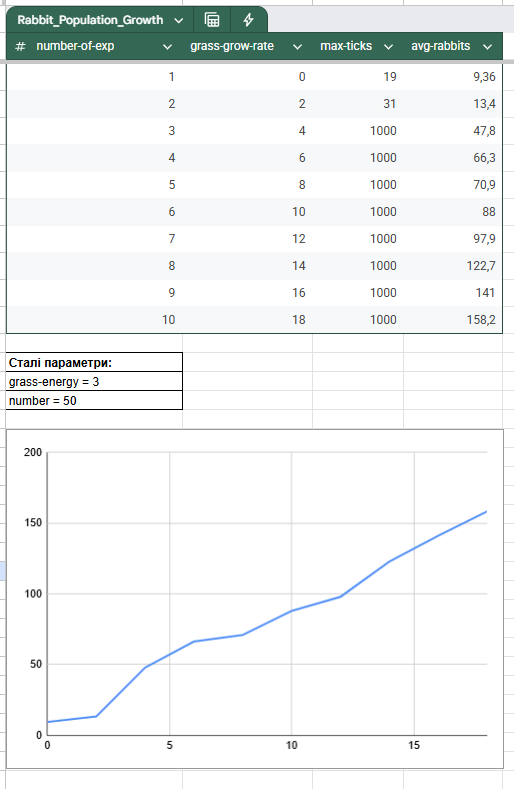
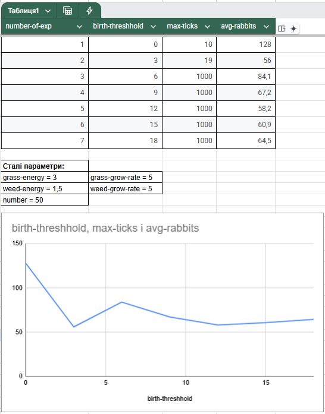
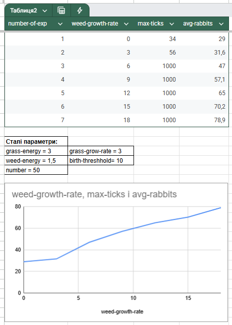



## Виконав: Зібаров Олександр Володимирович СПм-24-3

Індивідуальний варіант: 6 [http://www.netlogoweb.org/launch#http://www.netlogoweb.org/assets/modelslib/Sample%20Models/Biology/Rabbits%20Grass%20Weeds.nlogo](http://www.netlogoweb.org/launch#http://www.netlogoweb.org/assets/modelslib/Sample%20Models/Biology/Rabbits%20Grass%20Weeds.nlogo)

## **Частина 1. Загальний огляд моделі.**

**Опис моделі:**

Наша модель - це поле з клітинок, на яких можуть рости трава або бур’яни. По полю бігають кролики. У кожного є запас енергії: рух з’їдає 0.5 одиниці, а їжа додає - трава дає “grass-energy”, бур’ян - “weed-energy”. Порожні клітинки час від часу знову заростають: імовірність відростання трави і бур’янів задається параметрами grass-grow-rate і weeds-grow-rate.

Кролики рухаються навмання. Натрапивши на рослину, з’їдають її й підживлюються; клітинка стає пустою. Якщо кролик накопичив енергії більше за поріг birth-threshold, він розмножується: ділить свою енергію навпіл і “народжує” ще одного кролика поруч. Новонароджений має стільки ж енергії, скільки залишилось у батька після поділу. Якщо енергія кролика падає нижче нуля - він гине. Симуляція триває доти, доки в системі лишаються хоч якісь кролики.

Рослини поводяться простіше: після того як їх з’їли, вони не зникають назавжди, а з часом знову відростають. Швидкість відростання для трави і бур’янів може бути різною. Так само різною може бути “поживність”: скільки енергії отримає кролик за порцію трави чи бур’яну.

**Сутності:**

	rabbits - кролики, споживають grass і weeds, народжуються, коли накопичують енергію.

	grass і weeds - рослинність на клітинках, що відростає з різною швидкістю й дає різну енергію.

**Ключові керуючі параметри:**

	number - початкова кількість кроликів.

	birth-threshold - мінімальна енергія кролика для народження. (Батьківський кролик має поділ енергії після досягнення ліміту і віддає дитині її половину)

	grass-grow-rate - швидкість відростання трави.

	weeds-grow-rate - швидкість відростання бур’янів.

	grass-energy - енергія, яку кролик отримує, з’ївши grass.

	weed-energy - енергія , яку кролик отримує, з’ївши бур’ян.

**Недоліки моделі Rabbits Grass Weeds****:**

	1)Відростання - просто ймовірність на кожному тіку, незалежно від сусідів чи попередньої біомаси.

	2)Немає конкуренції між травою й бур’янами за ресурси; вони не взаємно пригнічують одне одного.

	3)Механізм “розділив енергію навпіл” - нереалістичний, але зручний; не враховує витрат на розмноження понад поділ.

	4)Немає територіальності чи конкуренції за клітинку між кроликами.

Ці спрощення роблять модель доброю для навчання й ілюстрації ідей “їжа - популяція”, але її висновки не слід безпосередньо переносити на реальні екосистеми без подальшого ускладнення та калібрування.

**Частина 2.Експерименти.**

1)**Нульова трава** **ПРОТИВ базового рівня** **трави** (Гіпотеза - Існує критичне значення grass-grow-rate, нижче якого популяція кроликів з високою ймовірністю вимирає до 1000 ticks)

Мета: показати, що без відростання трави кролики вимирають, а з мінімальним ростом - можуть триматися і стабільно держати популяцію.

Результат показує чітку позитивну залежність між швидкістю росту трави та середньою чисельністю кроликів: зі зростанням `grass-grow-rate` середня кількість кролів зростає (від ~9 при 0 до ~158 при 18). Існує поріг виживання/перехідна зона: при дуже низьких значеннях (0 і 2) моделі явно не вдається підтримувати популяцію — у таблиці `max-ticks` = 19 і 31, що вказує на швидке вимирання (симуляція закінчилась через відсутність кролів). При `grass-grow-rate >= 4` симуляція проходила до великого `max-ticks` (1000), тобто популяція змогла вижити довго.

**Висновки:**  за базового відростання трави популяція кроликів виживає до кінця прогону і входить у режим помірних циклів “підйом - спад”. Це показує, що навіть невелика продуктивність середовища достатня для самопідтримки популяції, на відміну від випадку з grass-grow-rate = 0 OR 2, де відбувається швидке вимирання.

2)**Низький** **ПРОТИВ** **високий поріг народжуваності** (Гіпотеза - Зниження birth-threshold підвищує середню чисельність кроликів, але збільшує амплітуду коливань (ризик перевипасу))

Мета: показати вплив birth-threshold на амплітуду коливань.

Є явна залежність між порогом для розмноження (birth-threshold) та динамікою популяції, але вона не монотонна. При дуже низькому порозі (0) модель дає швидкий «вибух» чисельності (avg ≈ 128), але прогін дуже короткий (max-ticks = 10) — тобто відбувається бум‑і‑колапс те саме і при пороговому значені 3.

**Висновки:** порівняно з частиною А  продуктивність була нижча: трава відростала повільніше, тож періоди “голоду” траплялися частіше і довше. Кролики теж виживали, але середній рівень був нижчим, а коливання — більш помітні: після сплеску народжуваності ресурс локально вичерпувався й чисельність просідала. У частині B швидше відростання трави згладжує ці провали: запас їжі встигає відновитися до того, як популяція скотиться надто низько, тому середній рівень кроликів піднімається і тримається стабільніше.

3)****Чи “рятують” бур’яни****? (Гіпотеза - додавання бур’янів (weeds-grow-rate > 0 , weed-energy > 0) зменшує ймовірність вимирання кроликів за фіксованого grass-grow-rate.)

Мета: показати, що альтернативна їжа підтримує популяцію при слабкому рості трави.

Додавання бур'янів як альтернативного ресурсу позитивно впливає на чисельність кролів: із зростанням weed-growth-rate середня кількість кролів зростає (приблизно від ~29 при 0 до ~79 при 18). При малих значеннях бур'янів модель іноді завершувалась рано (вимирання, короткий max-ticks), тоді як при більших значеннях симуляція переживала довго (1000 ticks) і популяція утримувалась.

**Висновки:** додавання бур’янів як альтернативного ресурсу під тим самим, не надто високим відростанням трави суттєво покращує виживання та середній рівень популяції кроликів.

**Частина 3. Висновки.**

Модель Rabbits Grass Weeds показує класичну взаємодію “ресурс - споживач” у просторовому середовищі. Кролики живуть за рахунок рослинності, яка відновлюється з певною швидкістю, і приймають прості рішення: рух, поїдання, розмноження за досягнення енергетичного порогу та смерть при виснаженні енергії. Попри простоту правил, система демонструє реалістичні ефекти: коливання чисельностей, чутливість до продуктивності середовища, порогові явища та стабілізуючу роль різноманіття ресурсів.

_Що ми побачили в експериментах_

1)Існує мінімальна продуктивність середовища, за якої популяція здатна підтримуватися. Коли трава не відростає (частина А експерименту 1), кролики швидко вмирають. Навіть помірний ріст трави (частина B) переводить систему у стійкий коливальний режим без колапсу.

2)Низький поріг народжуваності робить популяцію більш репродуктивною і допомагає переживати просідання ресурсів, але водночас може збільшувати амплітуду коливань. Вищий поріг знижує ризик “перевипасу”, проте підвищує уразливість до випадкових дефіцитів їжі.

3)Додаткове джерело їжі стабілізує систему. Коли до трави додаються бур’яни, навіть з невеликою поживністю, популяція рідше переживає критичні провали. Просторова мозаїка двох типів рослин працює як “екологічне страхування”: якщо один ресурс локально зник, інший часто є поруч.

_Чому обрані саме такі порівняльні експерименти_

Експеримент 1 (продуктивність трави) - це базова перевірка існування/відсутності ресурсу. Він дає найчіткіший контраст: з нульовим ростом трави популяція приречена; з мінімальним ростом — можливе виживання. Така пара умов дозволяє побачити порогову природу процесу та “мінімальну вимогу” до середовища.

Експеримент 2 (поріг народжуваності) - управлінський важіль, який прямо закладено в правилах. Поріг визначає темп поповнення популяції і, відповідно, схильність до перевипасу або до вимирання. Порівняння “низький vs високий” робить видимим компроміс між швидкістю відтворення і стабільністю.

Експеримент 3 (альтернативний ресурс) - тест ідеї про роль різноманіття. Ми порівняли систему з одним типом їжі та з двома, щоб перевірити гіпотезу про стабілізуючий ефект додаткового, навіть малокалорійного ресурсу. Це відповідає відомому в екології принципу: різноманіття джерел живлення підвищує стійкість до безперервного сталого існування будь-якої системи.
