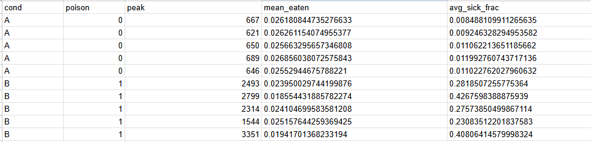

## Виконав: Зібаров Олександр Володимирович СПм-24-3

Індивідуальний варіант: 6 – [http://www.netlogoweb.org/launch#http://www.netlogoweb.org/assets/modelslib/Sample%20Models/Biology/Rabbits%20Grass%20Weeds.nlogo](http://www.netlogoweb.org/launch#http://www.netlogoweb.org/assets/modelslib/Sample%20Models/Biology/Rabbits%20Grass%20Weeds.nlogo)

Умова:

Додати можливість отруїтися при поїданні бур'янів (зазначена у внутрішніх параметрах, як певна вірогідність). Захворілий кролик не може харчуватися, переміщатися і розмножуватися, позначається іншим кольором і залишається хворим на 3 такти модельного часу. Додати поділ кроликів на самців та самок. Поява нових кроликів має вимагати не тільки ситості, а й здоров'я, та присутності в одній із сусідніх клітин іншого ситого здорового кролика протилежної статі. Поява потомства відбувається із ймовірністю 50%.

## **Внесені зміни у коді, задля досягнення умови, заданої в індивідуальному варіанті 6:**

_1)Додані нові валстивості для моделі кролика:_

	rabbits-own [ energy sex sick? sick-timer ]

	sex — рядок "m" або "f" (стать кожного кролика)

	sick? — булева ознака, чи хворий кролик.

	sick-timer — ціле число, скільки тіків ще хвороба триває

_2)При створенні кожного кролика задається (раніше лише_ _energy_==10):

	sex one-of ["m" "f"] (вірогідність 50% на 50%)

`sick? false`, `sick-timer 0` (кролики з'являються на полі абсолютно без дефектів та здорові)

	колір встановлюється за полом: самка = `red`, самець = `blue`

_3)Додано процесс хвороби/отруєння:_

	3.1 При поїданні бур'янів (`eat-weeds`):

	3.1.1 Бур'ян зникає (set pcolor black) і дається weed-energy (як раніше),

	3.1.2 Після цього відбувається перевірка ймовірності отруєння: if random-float 1 < weed-poison-prob (де weed-poison-prob — значення з Interface).

	3.1.3 Якщо отруєння сталося:

-sick? установлюється в true

-sick-timer встановлюється зі слайдера sickness-duration

-колір кролика змінюється на yellow

	3.1.4 В `go` кожен тік у кожного кролика, якщо `sick?` -зменшується `sick-timer`; коли таймер доходить до <=0 -  `sick?`  стає  `false` і колір повертається до попереднього кольору статі (`red` або `blue`))

	3.1.5 Поки кролик sick? = true, код блокує його дії: він не виконує move, eat-... і reproduce (тобто хворі не рухаються, не їдять, не розмножуються)

	3.1.6 Хвороба у вашій реалізації не вбиває прямо — sick кролики не втрачають енергію (оскільки вони не рухаються) і не мають додаткового зменшення енергії від хвороби. Тож хвороба -тимчасовий «блокувальний» стан, але не обов'язково фатальний (поки енергія не впаде < 0)

_4) Репродукція_

	Тепер reproduce виконується тільки якщо:

-energy > birth-threshold

-кролик не хворий (not sick?)

Додано пошук партнера: let partner one-of other rabbits in-radius 1 with [ energy > birth-threshold and not sick? and sex != [sex] of myself ]

Тобто партнер має бути в сусідніх клітинах (в радіусі 1), із протилежною статтю, ситий і здоровий

Якщо знайдено партнера — з ймовірністю 0.5 виконується народження (hatch 1)

Логіка енергетичних витрат при народженні: ініціюючий батько ділить свою енергію навпіл (set energy energy / 2) і дитина отримує ту ж енергію (set energy parent-energy)

У hatch дитина отримує  НЕ рандомну стать а успадковує її від одного з батьків з більшою поточною енергією, при народженні отримуючи її половину, її колір задається за статтю (red/blue)

NOTE. Процеси руху, харчування та смерті залишилися незміними від початкової реалізації

_5)Що додано/змінено в Interface (віджети)_

	5.1 Slider weed-poison-prob — ймовірність отруєння при їжі бур'янів (значення від 0 до 1). Код використовує цю змінну у eat-weeds.

	5.2 Slider sickness-duration — кількість тиков, які триває хвороба

	5.3 На Plot додалися pens з іменами `"males"` (синій) і `"females"` (червоний)

**Ідеї та внесені зміни у коді, задля досягнення індивідуальної вигаданої умови**

**Ідея:**

_1.Покращення поведінки_ _кроликів_

	1.1 Спрямований пошук їжі (якщо в радіусі 2 клітинок є виключно трава ток ролик їсть її а не бурян навіть якщо тот ближче)

	1.2 Смертність від хвороби: додати set energy energy - SICKNESS_COST (де SICKNESS_COST - нова змінна, наприклад 0.1). Це змусить хворих кроликів з низькою енергією втрачати енергію і помирати від виснаження, якщо хвороба триває довго

	1.3 Вік і старіння: Додати rabbits-own [ age ]. При створенні set age 0. У go (кожні 30 тіків імітація місяця пр дням) робити set age age + 1. У death додати if age > MAX_AGE [ die ] (де MAX_AGE - новий слайдер від 36 до 120)

_2. Покращення_ _та додання логіки для_ _патчів_

	2.1 Різні типи бур'янів/трав: Додамо різні види рослин з різною поживністю та ймовірністю отруєння

	2.2 Виснаження патчів: Патчі, де багато їли, відновлюються повільніше. Додати patches-own [ eaten-level ]. При поїданні set eaten-level eaten-level + 1. У grow-grass-and-weeds швидкість росту залежить від eaten-level

**Зміни внесені в код:**

##### _1.1 Спрямований пошук їжі (пріоритет трави в radius = 2)_

Логіка:

Змінна: `vision` (наприклад 2)

**Алгоритм у** `move`**:**

Знайти патчі в `in-radius vision` з `plant-type = "grass" or "tall-grass"`

Якщо є хоча б один - піти до найближчого (`let target min-one-of grass-patches [ distance myself ]`), `face target`, `fd 1`

Інакше шукати бур'яни у тому ж радіусі і йти до найближчого

Інакше — випадковий крок

	let grass-patches patches in-radius vision with [ plant-type = "grass" or plant-type = "tall-grass" ]

	if any? grass-patches [

	let target min-one-of grass-patches [ distance myself ]

	face target

	fd 1

	] [

	;; else search weeds, else random

	]

	set energy energy - 0.5

_1.2 Смертність від хвороби (sickness-cost)_

Логіка:

Слайдер `sickness-cost` (зазвичай 0..1, default 0.1)

Коли `sick? = true`, кожен тик (або кожну ітерацію в `go`) виконувати:

	set sick-timer sick-timer - 1

	set energy energy - sickness-cost

	if sick-timer <= 0 [ set sick? false ; set color base-color ]

_1.3 Вік і старіння_

Логіка:

Додати `rabbits-own [ age ]`

При створенні: `set age 0` для новонароджених

У `go`: кожні 30 ticks `ask rabbits [ set age age + 1 ]` (імітація місяця)

У `death`: `if age > max-age [ die ]` де `max-age`  - слайдер (36..120).

_2.1 Різні типи бур'янів/трав_

Нові властивості патчів:

`patches-own [ eaten-level plant-type plant-nutrition plant-poison-prob ]`

Значення `plant-type`:

`"none"`  - порожній патч (може показуватися як `black` або heatmap)

`"grass"`  - нормальна трава: `plant-nutrition = grass-energy`, `plant-poison-prob = 0`, `pcolor = green`

`"tall-grass"`  - більш поживна: `plant-nutrition = grass-energy * 1.5`, `pcolor = lime`

`"weed"`  - бур'ян: `plant-nutrition = weed-energy`, `plant-poison-prob = weed-poison-prob`, `pcolor = violet`

`"poison-weed"`  - отруйний підтип: `plant-nutrition = weed-energy * 0.6`, `plant-poison-prob = min (list 1 (weed-poison-prob + 0.25))`, `pcolor = magenta`

_2.2 Виснаження патчів (eaten-level)_

Логіка:

`patches-own [ eaten-level ]`, при `setup`: `ask patches [ set eaten-level 0 ]`.

При поїданні: `set eaten-level eaten-level + 1`.

У `grow-grass-and-weeds` кожен тік:

	set eaten-level max (list 0 (eaten-level - patch-recovery-rate))

Ефективна ймовірність росту:

	effective_grass_rate = grass-grow-rate / (1 + eaten-level)

	if random-float 1000 < effective_grass_rate [ grow grass ]

**Експеримент:**

Експеримент A (cond = A, poison = 0): контрольна умова - бур’яни не отруйні. Ми очікуємо відсутність отруєнь у кроликів і нормальний вплив поїдання на середнє виснаження патчів.

Експеримент B (cond = B, poison = 1): експериментальна умова - бур’яни повністю отруйні (ймовірність отруєння =  1). Тут отруєння після поїдання має викликати хворобливість (sick?), яка впливає на енергію/виживання.

 Основні метрики

Peak (максимум count-rabbits): показує максимальне розмноження/розквіт популяції у межах прогона. Високий peak - бум популяції.

Mean eaten-level: середній «рівень поїдання» патчів -індикатор того, наскільки сильно простір виснажувався. Більше mean_eaten більш виснажена/поїдена територія.

Avg sick fraction: середня частка кроликів, які позначені як хворі. Висока частка - сильний вплив токсичності на здоров’я популяції.

Підсумки по даним (обчислення для 5 прогони на кожну умову)

Експеримент A (poison = 0) - п’ять прогонів:

peak: [667, 621, 650, 689, 646]

Середнє (mean) ≈ 654.6 кроликів

Стандартне відхилення (std) ≈ 25.3

mean_eaten: [0.02618, 0.02626, 0.02566, 0.02686, 0.02553]

Mean ≈ 0.02610

Std ≈ 0.00057

avg_sick_frac: [0.00849, 0.00925, 0.01106, 0.01199, 0.01102]

Mean ≈ 0.01036 (≈1.04%)

Std ≈ 0.00145

Експеримент B (poison = 1) — п’ять прогонів:

peak: [2493, 2799, 2314, 1544, 3251]

Mean ≈ 2480.2 кроликів

Std ≈ 632.5 (велика варіативність)

mean_eaten: [0.02395, 0.01855, 0.02410, 0.02516, 0.01915]

Mean ≈ 0.02218

Std ≈ 0.00306

avg_sick_frac: [0.28185, 0.42676, 0.27574, 0.23084, 0.40896]

Mean ≈ 0.32483 (≈32.5%)

Std ≈ 0.0874

Основні спостереження:

Peak: у B середній peak ~2480, у A ~655 — тобто у B ти бачиш значно більші буми популяції. Різниця величезна (приблизно в 3–4 рази). Однак у B дуже велика варіативність (std ~633), в A — майже стабільно ~655 (std ~25)

Avg sick fraction: у A частка хворих дуже мала (~1%), у B — дуже велика (~32%). Це очікуваний ефект токсичності: у B багато кроликів отримують отруєння і стають sick?

Mean eaten: в A ≈0.0261, в B ≈0.0222 — значення близькі, але B трохи нижче. Це означає, що у B середнє поїдання на патч трохи менше або більш варіюється. Можливі причини - у B частина кроликів хворіє і не їсть, або отруйні бур'яни менш поживні/зникають по-іншому.

Пояснення можливого механізму (логічні гіпотези):

Умова B дає якусь додаткову енергетичну вигоду (наприклад, бур’яни дають енергію перед тим, як отруїти), тому популяція швидко зростає - великий бум. Після буму отруєння призводить до великої частки хворих і, можливо, до масових смертей пізніше (це не видно з піку).

Велика варіативність у B говорить, що процеси стохастичні й залежні від просторових випадковостей: іноді популяція розвивається дуже великою перед тим, як отруєння її зупиняє, в інших прогонах отруєння швидше контролює зростання.

Самі заміри:

