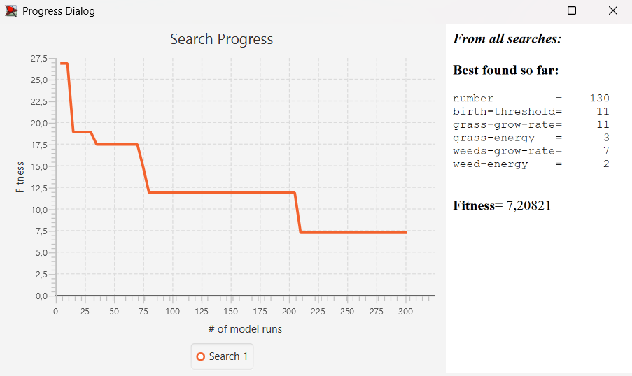
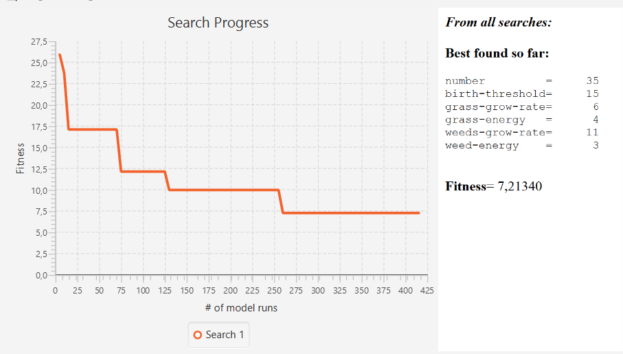

# Лабораторна робота №3. Оптимізація параметрів імітаційної моделі

## Вступ

На початку я хотів обрати удосконалену модель з лабораторної роботи 2, але вона кидала Java Error UNCHECKED, тому я обрав стартову модель, яка запускається без проблем.


---

## Опис моделі

Базова модель **Rabbits Grass Weeds** симулює екосистему з популяцією кроликів, які харчуються травою та бур'янами. 

### Керуючі параметри моделі:

- `number` - початкова кількість кроликів
- `birth-threshold` - поріг енергії для розмноження
- `grass-grow-rate` - швидкість росту трави
- `grass-energy` - енергія від трави
- `weeds-grow-rate` - швидкість росту бур'янів
- `weed-energy` - енергія від бур'янів

---

## Суть проблеми

Базова модель не містить зручного показника для оцінки стабільності популяції. Для вирішення завдання оптимізації необхідно було додати **функцію оцінки стабільності популяції** через розрахунок стандартного відхилення.

---

## Зміни в коді

### 1) Глобальні змінні (на початку файлу):

```netlogo
globals [ pop-hist hist-len ]
```

- `pop-hist` - список для зберігання історії популяції за останні N тактів
- `hist-len` - довжина історії (100 тактів)

### 2) Ініціалізація змінних у процедурі `setup`:

```netlogo
to setup
  clear-all
  
  set pop-hist []
  set hist-len 100
  
  ; ...інший код сетапу
end
```

Створюємо порожній список для зберігання історії та встановлюємо його максимальну довжину.

### 3) Збір статистики у процедурі `go`:

```netlogo
to go
  ; ... основний код симуляції
  
  ; Збираємо історію популяції
  set pop-hist lput (count rabbits) pop-hist
  if length pop-hist > hist-len [
    set pop-hist but-first pop-hist
  ]
  
  tick
end
```

Після кожного кроку симуляції додаємо поточну кількість кроликів до історії. Якщо довжина списку перевищує 100 елементів, видаляємо найстарше значення.

### 4) Reporter для розрахунку стабільності:

```netlogo
to-report population-stability
  if length pop-hist < 20 [
    report 99999
  ]
  
  if count rabbits = 0 [
    report 99999
  ]
  
  let mean-pop mean pop-hist
  
  if mean-pop < 20 [
    report 99999
  ]
  
  let squared-diffs map [ x -> (x - mean-pop) ^ 2 ] pop-hist
  let var-val mean squared-diffs
  let std-dev sqrt var-val
  
  report std-dev
end
```

**Пояснення роботи reporter:**

1. **Перевірка достатності даних:** Якщо історія містить менше 20 записів, повертається штрафне значення 99999 (недостатньо даних для коректного розрахунку).

2. **Перевірка вимирання:** Якщо популяція вимерла, повертається 99999 (нестабільна система).

3. **Розрахунок середнього значення:** `mean-pop` - середня кількість кроликів за весь період спостереження.

4. **Перевірка мінімальної популяції:** Якщо середня популяція менше 20 особин, система вважається нестабільною (штраф 99999).

5. **Розрахунок стандартного відхилення:**
   - Обчислюємо квадрати відхилень від середнього для кожного значення
   - Знаходимо середнє квадратів відхилень (дисперсію)
   - Обчислюємо квадратний корінь дисперсії (стандартне середньоквадратичне відхилення)

---

## Обрана фітнес-функція `population-stability`

Функція оцінює **стабільність популяції** через стандартне відхилення.

**Формула:**

```
std_dev = √( Σ(x - mean)² / n )
```

де:
- `x` - кількість кроликів на кожному кроці
- `mean` - середня популяція за період
- `n` - кількість спостережень

---

## Вибір задачі оптимізації

**Мета:** Знайти оптимальні значення параметрів моделі для досягнення **максимальної стабільності популяції кроликів**.

### Обґрунтування діапазонів параметрів

| Параметр | Діапазон | Обґрунтування |
|----------|----------|---------------|
| `number` | [30, 150] | Початкова популяція: < 30 - швидке вимирання через стохастичність; > 150 - перенаселення та виснаження ресурсів |
| `birth-threshold` | [3, 15] | Поріг народження: 0-2 - надмірне розмноження → цикли бум/крах; 15+ - недостатнє відновлення популяції |
| `grass-grow-rate` | [5, 25] | Швидкість росту їжі: < 5 - хронічний голод; > 25 - надлишок ресурсів → нестабільні коливання |
| `grass-energy` | [3, 10] | Енергія від трави: < 3 - недостатньо для виживання; 10 - біологічний максимум |
| `weeds-grow-rate` | [5, 25] | Альтернативне джерело їжі для балансування екосистеми |
| `weed-energy` | [2, 8] | Бур'яни менш поживні за траву |

### Стартові параметри для BehaviorSearch:

```
["number" [30 5 150]]
["birth-threshold" [3 1 15]]
["grass-grow-rate" [5 1 25]]
["grass-energy" [3 1 10]]
["weeds-grow-rate" [5 1 25]]
["weed-energy" [2 1 8]]
```

---

## Результати

### Випадковий пошук (Random Search)



#### Аналіз графіка Random Search:

**Графік:** Хаотична "сходинкова" структура з різкими стрибками fitness від початкового значення 27 до фінального 7.2. Оптимум знайдено на ~200 прогоні з 300.

**Best fitness:** 7.20821

**Найкращі знайдені параметри:**
```
number = 130
birth-threshold = 11
grass-grow-rate = 11
grass-energy = 3
weeds-grow-rate = 7
weed-energy = 2
```

**Короткий висновок:** Випадковий пошук швидко знайшов оптимум через везіння - потрапив у хорошу область простору параметрів вже на ранніх ітераціях. **Стратегія:** велика популяція (130) + помірний контроль розмноження.

---

### Генетичний алгоритм (StandardGA)

Для запуску використовуємо ті самі параметри, але вказуємо в конфігурації методу **StandardGA**.


#### Аналіз графіка StandardGA:

**Графік:** Плавна монотонна збіжність від fitness 27 до 7.2 через еволюційний процес. Оптимум досягнуто на ~350 прогоні. Характерна "гладка" траєкторія без різких стрибків.

**Best fitness:** 7.21340

**Найкращі знайдені параметри:**
```
number = 35
birth-threshold = 15
grass-grow-rate = 6
grass-energy = 4
weeds-grow-rate = 11
weed-energy = 3
```

**Короткий висновок:** GA показав передбачувану еволюційну збіжність, але знайшов результат на 0.07% гірший. **Стратегія:** мала популяція (35) + екстремальний контроль розмноження (threshold=15).

---

## Порівняння методів

### Порівняльна таблиця

| Критерій | Random Search | Genetic Algorithm |
|----------|---------------|-------------------|
| **Best fitness** | 7.20821 | 7.21340 |
| **Швидкість збіжності** | ~200 прогонів | ~350 прогонів |
| **Характер графіка** | Хаотичний, "сходинковий" | Плавний монотонний |
| **Стратегія** | Велика популяція (130) | Мала популяція (35) |
| **Контроль розмноження** | Помірний (threshold=11) | Екстремальний (threshold=15) |

---

## Висновки

### Ключовий висновок:

Обидва методи знайшли майже однакову стабільність (різниця 0.07%), але в **абсолютно різних точках параметричного простору**. Це доводить існування множинних рішень у задачі, які дають однаково хороший результат.

**Стратегія 1 (Random):** 130 кроликів + низький threshold 

**Стратегія 2 (GA):** 35 кроликів + високий threshold

Обидва підходи дають **std dev ≈ 7.2 кролика** (+-7% варіація популяції) - відмінна стабільність.

### Загальний висновок:

Для даної задачі та при заданих параметрах **Random Search виявився трохи ефективнішим** завдяки швидкому знаходженню цільового значення та простоті налаштування. 

**Genetic Algorithm** показав передбачуванішу збіжність, але потребував більше обчислень.


